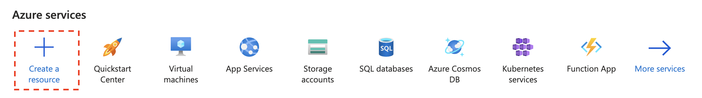
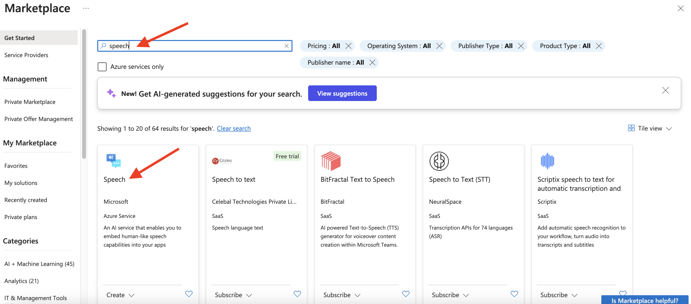
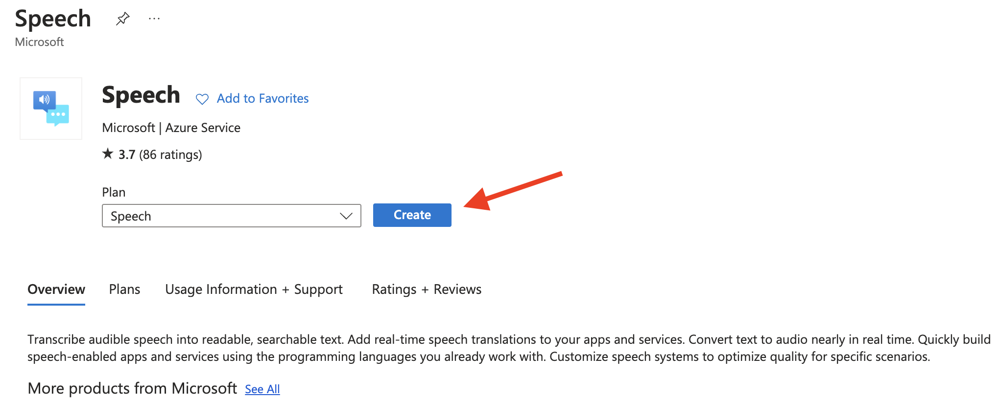
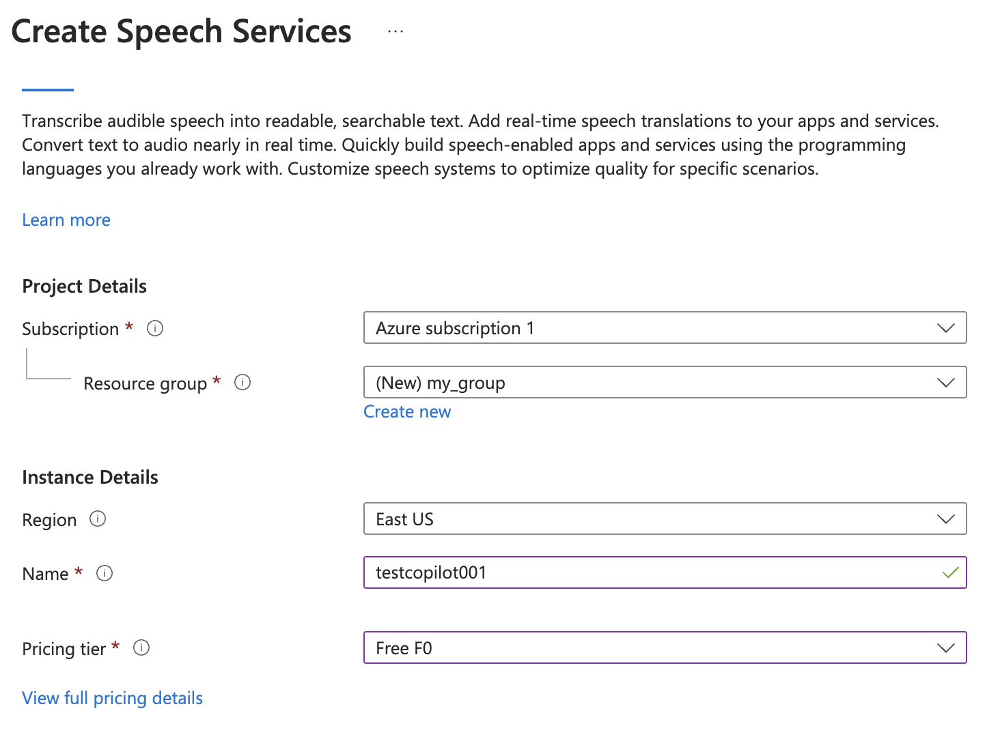
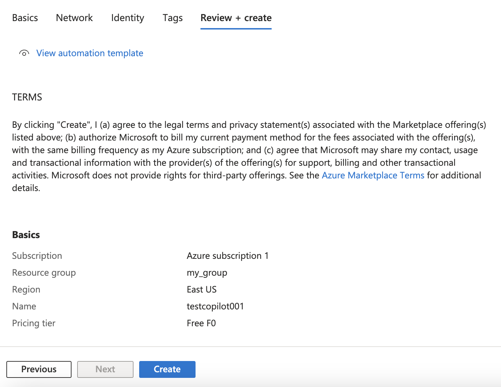
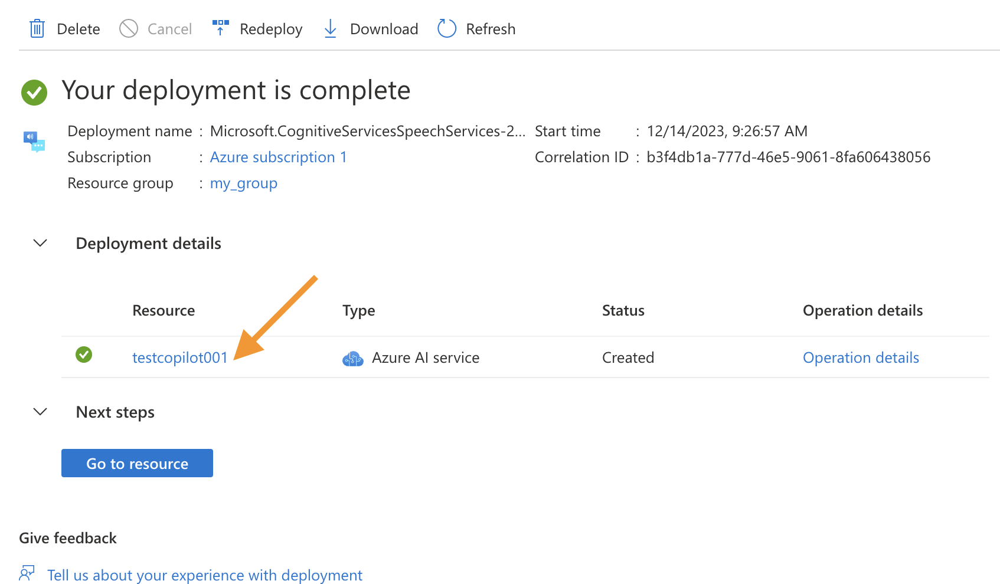
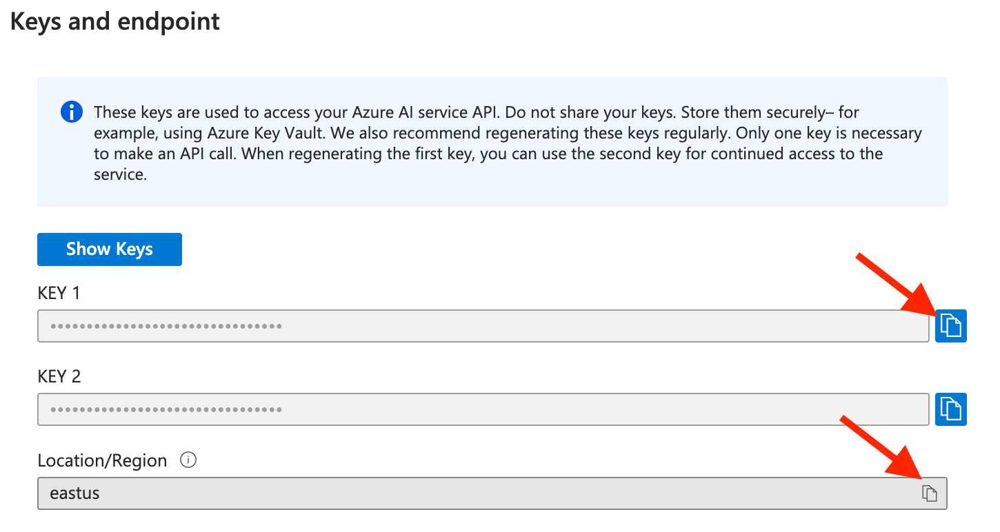

# Instructions for appling for a free Azure speech service token 

1. Register a  Microsoft Azure account :  https://azure.microsoft.com/
1. Open https://portal.azure.com/  and click "Create a resource":

3. Create a `Speech`  resource:

4. Fill out the form: 

**Resource Group**: Create one with a name of your prefer. 

**Instance Name**: Create one with a name of your prefer.

**Region**: Server location for the speech service, please choose the one closest to you to ensure connection speed. 

**Pricing tier:**  A free service is sufficient.

5.Keep the options on the Network, Identity, and Tags pages as default, and click "Next" continuously. 
 Finally click 'Create':

6. Click resource name to view the detail:

7. Copy the **KEY 1** and **Location/Region** to Interview Copilot :

